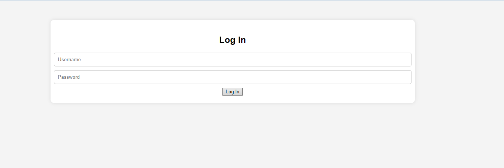

# App to integrate ChatGPT and Whisper API to build a microservie with springboot


## Installation

To install this application, follow these steps:

1. Clone the repository to your local machine:
2. Navigate to the application directory:
3. Run script

! ! ! Remember about Api key ! ! !
```
$ ./build_project.sh
```

## Solution

This is a Spring Boot application that utilizes the ChatGPT API. It allows for sending messages and transcriptions. The application features authentication via JWT token, and users are stored in an H2 database. The token is stored in cookies and expires after 100 seconds (modifiable). There are two available pages, /login and /chat, which enable frontend interaction. Additionally, there are two API endpoints, /api/v1/chat and /api/v1/transcription.

## Instruction
To use the application, users need to register a new account. If this step is not completed, the endpoints will deny access,
to add new user POST request on endpoint


/auth/register 

with body:
```
{
    "username": <username>,
    "password": <password>,
    "role": "USER"
}
```

### Login page
/login


### Chat page
/chat


## API
* /auth/register
```
  {
  "username": "",
  "password": "",
  "role": ""
  }
```
* /api/v1/chat

```
  {
  "question": "",
  }
```
* /api/v1/transcription
```
  MULTIPART_FORM_DATA_VALUE
```
