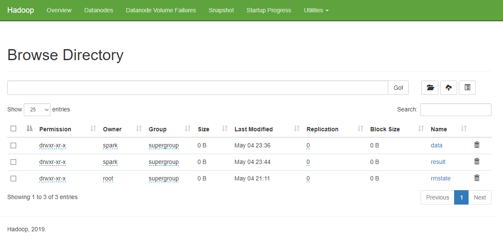
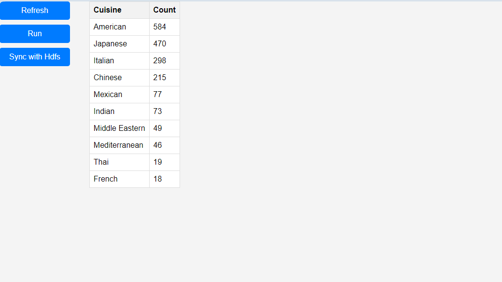

# Test 3

Micro Data Warehouse with Docker, Spring boot, Spark and Hadoop

## Installation

To install this application, follow these steps:

1. Clone the repository to your local machine:
2. Navigate to the application directory:
3. Run script
```
$ ./build_project.sh
```

## Main Solutions 

* **Hadoop upload and dataset process**

  The dataset has been added to HDFS using the CsvUpload script and executed by Spark, allowing for partitioning tailored to the amount of data. Although a file can also be added using a simple hadoop put command, I opted for the first option as it is more versatile and allows for partition manipulation. In this case, I utilized only one partition since the data volume was not significant, and merging results from individual partitions might have yielded a less favorable outcome compared to analyzing a single file.


* **Applicaiton will generate 10 top quisine types from the dataset**

  The application generates results and stores them in HDFS. I considered using an external database but decided against it since HDFS is available, making the implementation of a new solution unnecessary. I can retrieve the result from HDFS through Spark, which simplifies the process and avoids adding unnecessary complexity.

* **Retrievement results from the processed dataset via java springboot**

  The Spring Boot application utilizes Spark to read the result of a script from HDFS, specifically from the /result folder. Subsequently, it displays this result on a JSP view. I utilize Spark's REST API for running jobs.


## Instruction

Go to: localhost:8889/result


The refresh button is used to refresh fronted.

The run button is used to execute the script for calculating the Top Cuisine Types.

The Sync with HDFS button is used to load the result of the Top Cuisine Types and save it in the Spring Boot memory.
